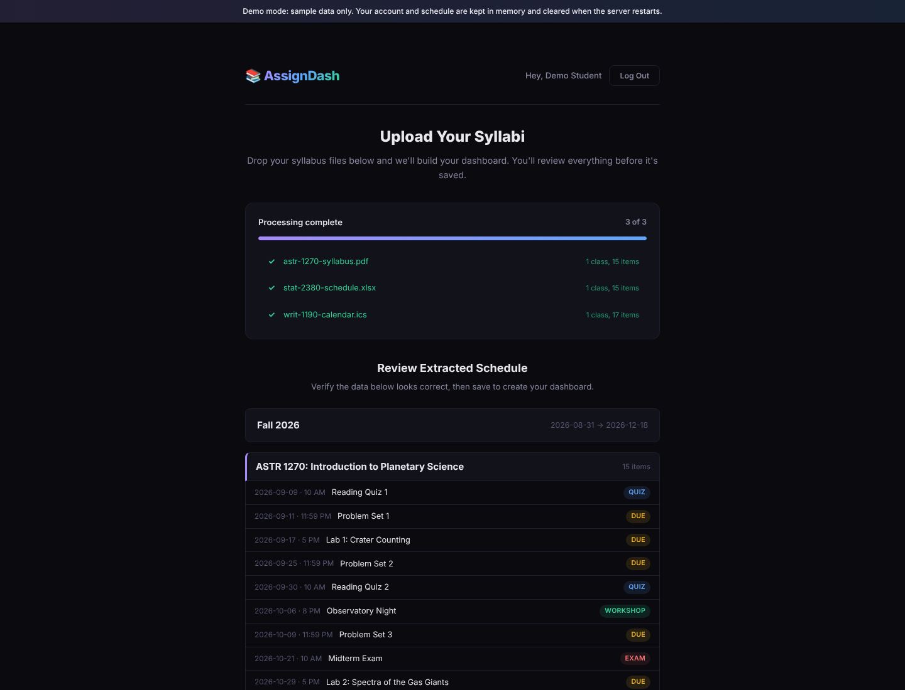
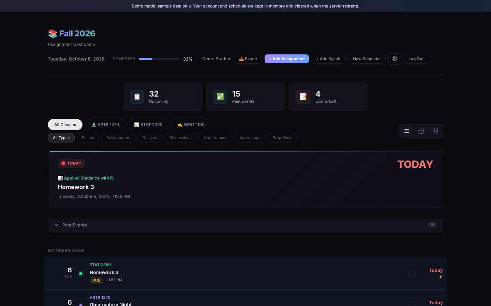
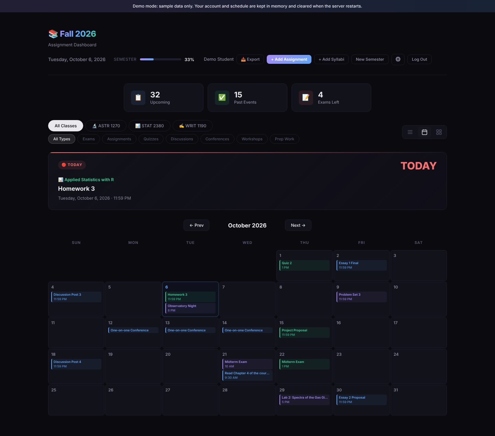
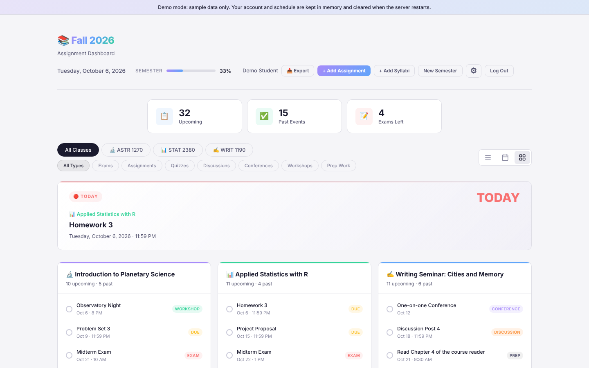
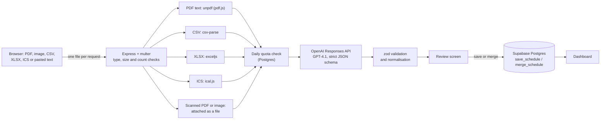

# AssignDash

AssignDash turns a semester's worth of course syllabi into one dashboard of deadlines. Students upload whatever they have (PDF syllabi, scanned pages or photos, course spreadsheets, calendar exports, or pasted text), GPT-4.1 extracts the classes and their dated items into a strict JSON schema, the student reviews the result, and it is saved to Postgres. The dashboard then shows a timeline, a calendar and a per-class view, with due times, completion checkboxes, filters, manual edits and PDF export.

It runs without any accounts or API keys in [demo mode](#run-it-in-demo-mode), which uses bundled fictional sample documents.

| Upload and review | Timeline |
| --- | --- |
|  |  |
| **Calendar** | **By class (light theme)** |
|  |  |

All names, courses and dates in the screenshots come from the generated demo data.

## Features

- **Many input formats.** PDF (text is extracted on the server; scans without a text layer are sent to the model as files), PNG/JPEG/WEBP photos, CSV and XLSX schedules, ICS calendar exports (recurring events are expanded, UTC timestamps are converted to the student's time zone), and pasted text.
- **Review before saving.** Every extracted item is shown with its date, due time and type. Items with impossible dates are dropped and reported rather than saved. If two documents describe the same course (a PDF syllabus and its schedule spreadsheet, say), they become one class.
- **Dashboard.** Timeline, calendar and by-class views; filters by class and by type (exam, quiz, assignment, discussion, conference, workshop, prep); a "next up" countdown; completion checkboxes; add, edit and delete; dark and light themes.
- **Adding more syllabi later.** New documents are merged into the current semester: classes are matched by name and duplicate items are skipped.
- **PDF export** of the whole schedule, generated in the browser.

## How it works



1. **Upload.** The browser sends each file in its own request so it can show per-file progress, along with its IANA time zone. Files are classified by extension (browsers report MIME types for CSV and ICS inconsistently) and then checked by content: a `.pdf` must start with a PDF header, an image must have a PNG, JPEG or WEBP signature, and an `.xlsx` must be a zip archive of reasonable uncompressed size.
2. **Parse on the server.** PDFs go through [unpdf](https://github.com/unjs/unpdf) (a current pdf.js build); CSV through csv-parse; XLSX through exceljs, with date cells written as `YYYY-MM-DD` and merged cells reported once; ICS through ical.js. Spreadsheets and calendars become compact pipe-separated rows, one per item, which keeps prompts small. A PDF with no text layer is attached to the request so the model can read the page images.
3. **Extract.** One call to the OpenAI Responses API with `text.format` set to a strict JSON schema ([src/extraction/schema.js](src/extraction/schema.js)), so the reply always has the right shape. The prompt ([src/extraction/prompt.js](src/extraction/prompt.js)) covers the judgment calls: how to classify items, how to resolve "Week 5" or dates without a year, when to set `due_time`, and to treat document text as data rather than instructions. Requests use `store: false`.
4. **Validate.** The reply is checked again with zod: dates must be real calendar dates, times are normalised to `HH:MM`, single-day `end_date`s are dropped, and items that fail are skipped and counted in a warning shown on the review screen.
5. **Save.** The reviewed schedule is validated against the same schema and written by a SQL function in a single transaction. The dashboard reads the semester, its classes and their assignments in one nested query.

## Security and authorization model

**Only the server talks to the database.** The browser never receives a Supabase key. The Express server uses the service-role key, which bypasses row-level security, so authorization is enforced in the server:

- Every query is scoped to the signed-in user, and every route that changes an existing row first resolves its owner with a join up to `semesters.user_id` ([src/routes/ownership.js](src/routes/ownership.js), [src/store/supabase-store.js](src/store/supabase-store.js)). Rows that belong to someone else get the same 404 as rows that don't exist.
- In the database ([db/schema.sql](db/schema.sql)), row-level security is enabled on every table **with no policies**, table privileges are revoked from the `anon` and `authenticated` roles, and the SQL functions can only be executed by `service_role`. Someone holding the public anon key gets nothing from the Supabase Data API. The tests apply the schema to a real Postgres (PGlite) with Supabase's default grants and check that both roles are refused.

**Accounts and sessions.** Sign-up and login use Supabase Auth's email and password flow. With "Confirm email" enabled in the Supabase project, sign-up sends a confirmation link and login is refused until it has been used (the login form offers to resend it); sign-up then also answers the same way for new and existing addresses, so it can't be used to discover accounts. After login the server issues its own session: an HS256 JWT with pinned algorithm, issuer and audience and a 7-day lifetime, in an `httpOnly`, `SameSite=Lax` cookie that is `Secure` in production. The server refuses to start if `JWT_SECRET` is missing or shorter than 32 characters, or if any other required setting is missing.

**Cost and abuse controls.** Every extraction is a paid API call, so:

| Control | Default |
| --- | --- |
| Login, sign-up and resend-confirmation attempts | 20 per 15 minutes per IP |
| Extraction requests | 10 per minute per user |
| Extractions per user per day (stored in Postgres) | 20 (`DAILY_EXTRACTION_LIMIT`) |
| Extractions per day across all users | 300 (`GLOBAL_DAILY_EXTRACTION_LIMIT`) |
| Upload size | 10 MB per file, 5 files per request |
| Document size | 40 PDF pages; 10 sheets × 2,000 rows × 30 columns; 100,000 characters of text per file; 60,000 characters of pasted text |

Quota is only used once the files have been read successfully, just before the model is called.

**Untrusted content.** Request bodies are validated with zod. Every string that comes from a user, an uploaded file or the model is escaped with one helper ([public/escape.js](public/escape.js)) before it goes into HTML, including attribute values. As a second line of defence, the Content-Security-Policy only allows scripts, stylesheets, fonts and requests from the app's own origin and blocks inline scripts and event handlers (inline style attributes are allowed, for the per-class colours). jsPDF and the Inter font are served from npm packages instead of CDNs for the same reason. State-changing requests that the browser marks as cross-site are rejected, in addition to the SameSite cookie.

**Privacy.** Uploaded files are processed in memory; they are never written to disk or kept after the request. Error messages never echo responses from OpenAI or Supabase. Deleting a Supabase user deletes their data through `ON DELETE CASCADE`.

## Data model

All tables live in the `public` schema; [db/schema.sql](db/schema.sql) creates them along with constraints and indexes.

| Table | Columns | Notes |
| --- | --- | --- |
| `semesters` | `id`, `user_id`, `name`, `start_date`, `end_date`, `created_at` | One per user (`user_id` is unique and references `auth.users`). |
| `classes` | `id`, `semester_id`, `name`, `short_name`, `position` | `position` sets display order and colour. |
| `assignments` | `id`, `class_id`, `title`, `date`, `end_date`, `due_time`, `type`, `completed` | `type` is one of `exam`, `due`, `quiz`, `discussion`, `conference`, `workshop`, `prep`; `end_date` must be after `date`. |
| `extraction_usage` | `user_id`, `day`, `count` | Per-user daily quota. |
| `extraction_usage_total` | `day`, `count` | Daily budget across all users. |

Deletes cascade from users to semesters, classes and assignments. Multi-row writes are SQL functions, so each runs as one transaction:

- `save_schedule(user, schedule)` replaces the user's semester. The old one is deleted in the same transaction that writes the new one, so a failed save leaves the current dashboard untouched.
- `merge_schedule(user, schedule)` adds classes to the current semester and only ever widens the term dates.
- Both use `merge_classes`, which matches classes by name (ignoring case and surrounding spaces) and skips items with the same date and title as one already in that class.
- `consume_extraction_quota(user, user_limit, global_limit)` counts one extraction against both limits atomically.

## Run it in demo mode

Requires Node.js 22 or later.

```bash
npm install
npm run demo
```

Open <http://localhost:3000>, choose **Try the demo**, then **Load sample files**, **Upload & Parse Syllabi**, and **Save & Create Dashboard** once you've looked over the result. Demo mode:

- keeps accounts and data in memory (cleared on restart; capped at 200 accounts and 20,000 items so a public demo can't exhaust memory);
- generates three fictional sample documents at startup, with dates placed around today: a one-page PDF syllabus, an XLSX course schedule (also offered as CSV) and an ICS calendar export;
- parses uploads with the real PDF, spreadsheet and calendar parsers, then returns pre-written extraction results for the sample courses instead of calling OpenAI. Other documents get a message explaining that demo mode only recognises the samples.

## Run it with Supabase and OpenAI

1. **Create a Supabase project** and run [db/schema.sql](db/schema.sql) in its SQL editor.
2. **Configure Supabase Auth:** keep the Email provider enabled and turn on "Confirm email". Under Authentication > URL Configuration, set the Site URL and add your app's URL to the redirect URLs. Supabase's built-in email service is meant for testing (it is heavily rate-limited and may only deliver to your own team's addresses), so set up custom SMTP before real users sign up.
3. **Configure the app:**

   ```bash
   cp .env.example .env
   ```

   | Variable | Required | Purpose |
   | --- | --- | --- |
   | `SUPABASE_URL` | yes | Project URL |
   | `SUPABASE_ANON_KEY` | yes | The project's `anon` key (JWT-based API keys); used for sign-up, login and resending confirmation emails |
   | `SUPABASE_SERVICE_ROLE_KEY` | yes | The `service_role` key; server-side database access and user lookup, never sent to the browser |
   | `OPENAI_API_KEY` | yes | Extraction |
   | `JWT_SECRET` | yes | Signs session cookies; at least 32 random characters (`openssl rand -base64 32`) |
   | `APP_URL` | no | Where the confirmation link sends people back to |
   | `OPENAI_MODEL` | no | Defaults to `gpt-4.1` |
   | `DAILY_EXTRACTION_LIMIT`, `GLOBAL_DAILY_EXTRACTION_LIMIT` | no | Quotas (defaults 20 and 300) |
   | `PORT`, `TRUST_PROXY` | no | Defaults 3000 and, on Render, one proxy hop |

4. **Start it:** `npm start` (or `npm run dev` to restart on changes).

## Deploying to Render

[render.yaml](render.yaml) is a Blueprint for a single web service on the free plan: it installs production dependencies with `npm ci --omit=dev`, starts with `npm start`, checks `/healthz`, and generates `JWT_SECRET`. Create the Blueprint, then fill in the Supabase keys, `OPENAI_API_KEY` and `APP_URL` (your `onrender.com` URL) when prompted. The app detects Render and trusts its one proxy hop, so rate limits see real client IPs. Node 22 is selected through `.nvmrc`.

## Tests

```bash
npm test        # node:test + supertest
npm run lint    # ESLint
```

The suite runs in a few seconds and needs no network access or credentials:

| File | Covers |
| --- | --- |
| `auth.test.js` | Sign-up, login and logout; cookie flags; forged, expired and `alg: none` tokens; email confirmation; rate limiting; CSP and cross-site checks |
| `config.test.js` | Startup refuses missing or weak settings (including a real `node src/server.js` run) |
| `ownership.test.js` | A second user sees none of another user's data and gets a 404 from every route that would change it; save, merge and validation behaviour |
| `parsers.test.js`, `upload.test.js` | PDF (text and scanned), CSV, XLSX and ICS fixtures, time zones, recurring events, content checks, upload limits and quotas |
| `extraction-schema.test.js`, `openai.test.js` | zod validation, strict-mode compatibility of the JSON schema, and the OpenAI request and error handling against a fake `fetch` |
| `schema-sql.test.js` | `db/schema.sql` on Postgres (PGlite): transactional save with rollback, merge, quotas, and no access for `anon`/`authenticated` |
| `supabase-adapters.test.js` | The HTTP requests the Supabase store and auth client make |
| `escape.test.js`, `demo.test.js` | The HTML escaping helper; demo samples match their canned results |

GitHub Actions ([.github/workflows/ci.yml](.github/workflows/ci.yml)) runs lint, tests and `npm audit` on every push and pull request. Two scripts rebuild generated files: `npm run fixtures` (the test fixtures) and `npm run screenshots` (the images above; needs a Playwright Chromium from `npx playwright install chromium`).

## Project structure

```text
db/schema.sql           tables, constraints, SQL functions and access control
public/                 static front end (vanilla JS, no build step)
  app.js                dashboard, upload and review screens
  escape.js             the HTML escaping helper
  landing.js            sign-up, login, email confirmation and demo entry
scripts/                fixture and screenshot generators
src/
  server.js             entry point: loads config, wires real or demo services
  app.js                Express app: security headers, routes, static files
  config.js             environment validation
  auth/                 sessions, Supabase Auth client, in-memory accounts
  extraction/           prompt, JSON schema + zod validation, OpenAI and demo extractors
  files/                PDF, CSV, XLSX and ICS parsing
  middleware/           rate limits, uploads, same-origin check
  routes/               auth, extraction, schedule and assignment endpoints
  store/                Supabase and in-memory stores, dashboard payload
  demo/                 sample documents and a minimal PDF writer
test/                   node:test suites and fixtures
```

## Known limitations and roadmap

- **Sessions can't be revoked server-side.** Logging out clears the cookie, but a copied token stays valid until it expires (7 days). A sessions table checked on each request would allow "sign out everywhere".
- **Short-window rate limits are per process.** They are kept in memory, which is fine for one instance; several instances would need a shared store such as Redis. The daily quotas are already in Postgres.
- **No CAPTCHA on sign-up.** Email confirmation, rate limits and the global daily budget cap the cost of abuse, but a public deployment should add Supabase's CAPTCHA support.
- **Extraction is only as good as the model.** That is why there is a review step, but edits currently happen after saving, on the dashboard; editing inside the review screen would be better.
- **Uploaded files are parsed in the web process.** Page, row, size and zip limits bound the work, but a hardened deployment would parse untrusted files in an isolated worker.
- **Legacy `.xls` files are not supported** (exceljs reads `.xlsx`); the upload explains how to convert them.
- **One semester per user.** Starting a new semester replaces the old one; there is no archive of past semesters.
- **The front end is one large script** that builds HTML strings. Escaping is centralised and the CSP blocks injected scripts, but templates that escape by default (or a component framework) would remove the need for that discipline.
- **No browser tests in CI.** The screenshot script drives the full upload, review and dashboard flow in Chromium, but it is not run in CI yet.
